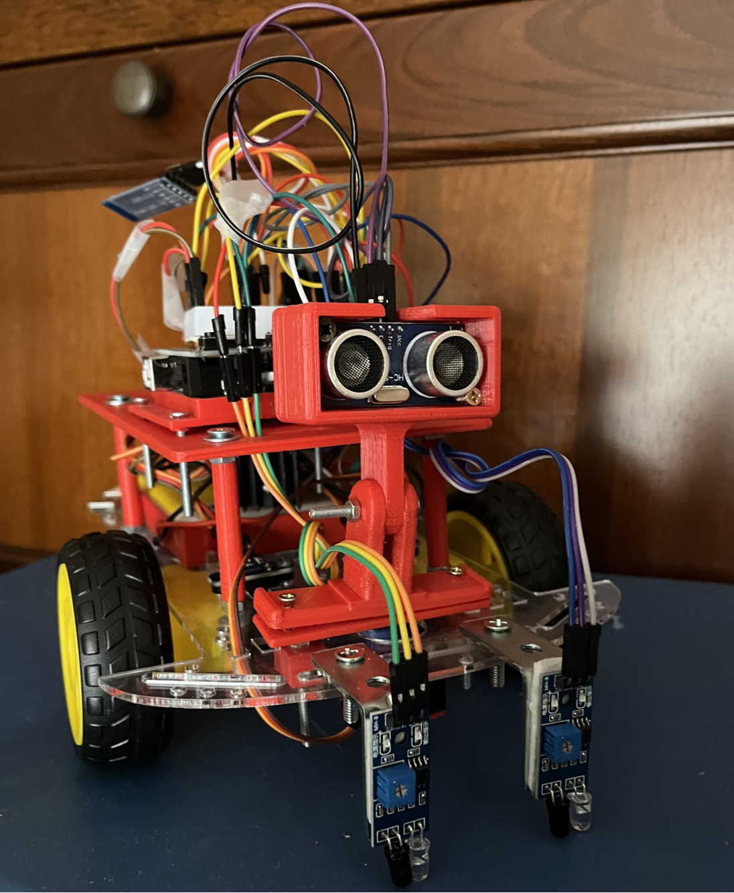

# Ard_ros_robot

   

## Features

WoLF provides several features for your quadruped robotic friend:

|  Object Avoid |  Line Follof | Navigation ready  | Loco-manipulation  | Multi robot  |
|:-:|:-:|:-:|:-:|:-:|
|   |     |   |   |   |

